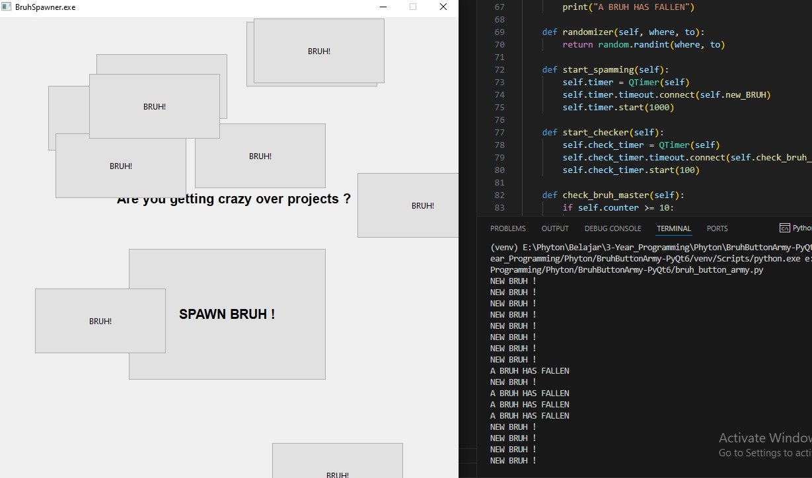
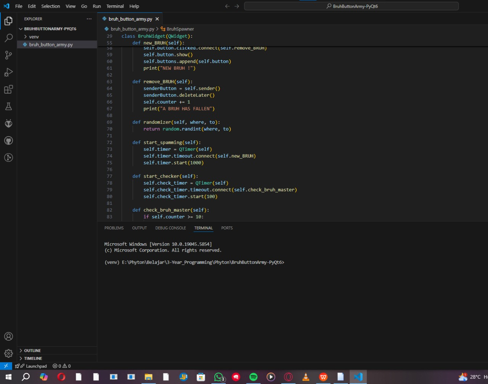

# 🔥 BruhButtonArmy-PyQt6 🔥

*Tired of debugging? Procrastinating that overdue project?
This is the dumbest, most beautiful PyQt6 stress relief you'll ever see.*

---

## 📦 What it does:
Spams BRUH buttons on your screen.

Every click deletes a BRUH.

Reach 10 deletions to unlock the BRUH MASTER title.

---

## 🚀 How to run:
```bash
python bruh_button_army.py
```

---

## 📸 Screenshots



---

## 🤝 Disclaimer:
"*This is a joke app made by a programmer who was drowning in deadlines.*" 

